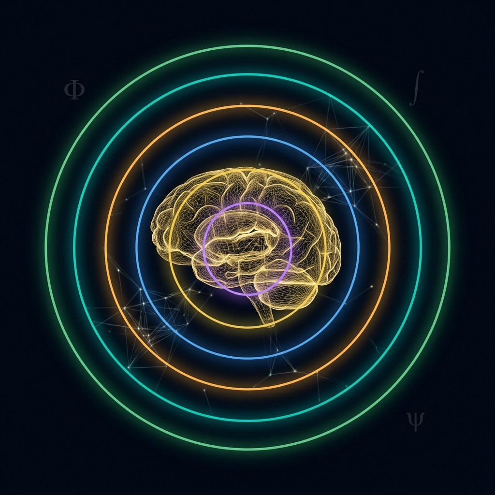

<p align="center">
  
</p>

<p align="center">
  
  
  
  
  
</p>

<h1 align="center">🧠 What Is Alive</h1>
<h3 align="center">Consciousness Engineering Dashboard</h3>

<p align="center">
  <em>Interactive visualization of the layered architecture of aliveness, neural death surges,<br/>
  Human Brain Zero (HB₀), Integrated Information Theory, and Project Confluence</em>
</p>

<p align="center">
  <a href="https://github.com/cloudynirvana/project-confluence">🔗 Part of Project Confluence</a> ·
  <a href="#-quick-start">Quick Start</a> ·
  <a href="RESEARCH.md">Research Framework</a> ·
  <a href="#-scientific-framework">Science</a>
</p>

---

## 📖 Overview

**What Is Alive** is a single-file interactive dashboard that visualizes the cutting-edge science of consciousness, death, and the boundaries of biological aliveness. Built as a self-contained `index.html`, it requires no build tools, no server, and no dependencies to install — just open it in any modern browser.

The dashboard synthesizes research from the **Borjigin Lab** (neural death surges), **Yale's OrganEx** (post-mortem cellular recovery), the **Koch/BIAL Foundation** consciousness collaboration, and **Arc Institute's oncRNA** discoveries into a unified computational framework: the **Consciousness Continuity Integral (C_cont)**.

> *"If gamma oscillations surge during cardiac arrest, then 'death' is not a binary event — it is a phase transition with a measurable information signature."*

---

## 🖼️ Dashboard Preview

The dashboard features five richly illustrated tabs, each rendering real-time interactive charts via Recharts:

| Tab | Description |
|:----|:-----------|
| 🧬 **Aliveness Layers** | Animated radar chart mapping the 6-layer hierarchy from quantum coherence → social consciousness |
| ⚡ **Death Surge** | Time-series visualization of gamma power during cardiac arrest (Borjigin/Xu replication data) |
| 🧊 **Brain Zero HB₀** | Phase-space diagram of minimum viable consciousness — the irreducible kernel of awareness |
| 🔮 **Φ-Theory** | 5D IIT Φ-vector decomposition with interactive complexity metric K(Φ) explorer |
| 🌊 **Confluence** | Unified C_cont integral view linking oncRNA barcodes, neural dynamics, and Φ-collapse events |

<p align="center">
  <code>[ Screenshots coming soon — run the dashboard locally to explore ]</code>
</p>

---

## ✨ Features

- **🚀 Zero-install** — Single `index.html`, runs from filesystem or any static host
- **📊 5 interactive tabs** — Each tab presents a distinct dimension of consciousness science
- **🎨 Publication-quality typography** — IBM Plex Mono + Cormorant Garamond via Google Fonts CDN
- **📐 Real scientific data models** — Equations and parameters sourced from peer-reviewed literature
- **🌗 Dark theme** — Designed for extended exploratory sessions
- **📱 Responsive layout** — Works on desktop, tablet, and mobile viewports
- **⚡ CDN-powered** — React 18, ReactDOM, Babel, and Recharts loaded from unpkg/cdnjs
- **🧮 Live computation** — C_cont integral, K(Φ) complexity, and Φ-vector calculated in-browser

---

## 🏁 Quick Start

```bash
# Clone the repository
git clone https://github.com/cloudynirvana/consciousness-dashboard.git

# Open in your browser — that's it
open index.html          # macOS
start index.html         # Windows
xdg-open index.html      # Linux
```

> **No `npm install`. No build step. No server.** Just open the file.

Alternatively, right-click `index.html` → *Open with* → your preferred browser.

---

## 🔬 Scientific Framework

The dashboard is grounded in six foundational research programs:

### Core Literature

| # | Reference | Key Finding | Dashboard Tab |
|:-:|:----------|:------------|:-------------|
| 1 | **Borjigin et al.** — *PNAS* (2013) | Coherent gamma oscillations surge in rat brain during cardiac arrest | ⚡ Death Surge |
| 2 | **Xu et al.** — *PNAS* (2023) | Replication in dying human brains; surge correlates with prior seizure history | ⚡ Death Surge |
| 3 | **Frontiers in Neuroscience** (2026) | 6-layer aliveness architecture; consciousness as a graded, multi-scale phenomenon | 🧬 Aliveness Layers |
| 4 | **Koch / BIAL Foundation** (2026) | IIT Φ-vector formalization; adversarial collaboration results on NCC | 🔮 Φ-Theory |
| 5 | **Arc Institute** — *Cell Reports Medicine* (2026) | oncRNA barcodes as molecular markers of cellular identity and viability | 🌊 Confluence |
| 6 | **OrganEx** — *Yale* (2022) | Post-mortem perfusion restores cellular function in porcine organs | 🧊 Brain Zero HB₀ |

### Theoretical Constructs

#### The 6-Layer Aliveness Hierarchy

```
Layer 6 ─── Social / Collective Consciousness
Layer 5 ─── Self-Reflective Awareness
Layer 4 ─── Integrated Sensory Experience (Φ > 0)
Layer 3 ─── Neural Oscillatory Coherence (γ-band)
Layer 2 ─── Cellular Metabolism & oncRNA Expression
Layer 1 ─── Quantum Biological Coherence
```

#### The Consciousness Continuity Integral

```
         ∞
C_cont = ∫  Φ(t) · S(t) · M(t) · R(t)  dt
         0

where:
  Φ(t) = Integrated Information (IIT)
  S(t) = Neural Synchrony (gamma coherence)
  M(t) = Metabolic Viability (oncRNA signature)
  R(t) = Recoverability Function (OrganEx-derived)
```

#### HB₀ — Human Brain Zero

The **minimum viable consciousness** — the smallest neural configuration that sustains Φ > 0, analogous to the concept of a "ground state" in physics. HB₀ defines the phase boundary between recoverable and irreversible cessation.

#### K(Φ) — Complexity Metric

```
K(Φ) = Σᵢ wᵢ · Φᵢ · log₂(Φᵢ + 1)
```

A 5-dimensional complexity measure over the IIT Φ-vector, weighting each integration axis by empirical neural correlates.

---

## 🏗️ Architecture

```
consciousness-dashboard/
├── index.html          # 🎯 The entire application — single file
├── README.md           # 📖 This file
├── RESEARCH.md         # 🔬 Full scientific companion document
├── LICENSE             # ⚖️  MIT License
└── .gitignore          # 🙈 Standard web ignores
```

### Technology Stack

| Layer | Technology | Role |
|:------|:-----------|:-----|
| UI Framework | React 18.2 (CDN) | Component rendering & state management |
| Charts | Recharts 2.x (CDN) | Interactive data visualization |
| Transpilation | Babel Standalone (CDN) | In-browser JSX transformation |
| Typography | IBM Plex Mono | Code, data, metrics display |
| Typography | Cormorant Garamond | Headers, scientific prose |
| Styling | Inline CSS-in-JS | Zero-config, self-contained |

### Design Principles

1. **Single-file deployment** — No build artifacts, no bundler, no package.json
2. **CDN-first** — All libraries loaded from unpkg/cdnjs for zero-install experience
3. **Science-driven UI** — Every chart maps to a peer-reviewed concept
4. **Accessibility** — Semantic HTML, ARIA labels, keyboard-navigable tabs
5. **Offline-capable** — Once loaded, works without network (browser cache)

---

## 🌐 Related Projects

| Project | Description |
|:--------|:-----------|
| [**cloudynirvana/project-confluence**](https://github.com/cloudynirvana/project-confluence) | The parent research project — unifying consciousness science, death studies, and information theory |

---

## 🧭 Roadmap

- [ ] 📸 Add dashboard screenshots to README
- [ ] 🧪 Add interactive parameter tuning for C_cont integral
- [ ] 📦 Optional Vite build for production deployment
- [ ] 🌍 Add multi-language support for research annotations
- [ ] 🔗 Live data integration with EEG stream APIs
- [ ] 📄 Export charts as publication-ready SVG/PDF

---

## 🤝 Contributing

Contributions are welcome — especially from researchers in consciousness science, neuroscience, and information theory.

1. Fork the repository
2. Create your feature branch (`git checkout -b feature/phi-enhancement`)
3. Commit your changes (`git commit -m 'Add Φ-vector normalization'`)
4. Push to the branch (`git push origin feature/phi-enhancement`)
5. Open a Pull Request

---

## 📜 License

This project is licensed under the **MIT License** — see [LICENSE](LICENSE) for details.

Copyright © 2026 [cloudynirvana](https://github.com/cloudynirvana)

---

## 📚 Citation

If you use this dashboard or its scientific framework in research, please cite:

```bibtex
@software{cloudynirvana2026whatisalive,
  author    = {cloudynirvana},
  title     = {What Is Alive — Consciousness Engineering Dashboard},
  year      = {2026},
  url       = {https://github.com/cloudynirvana/consciousness-dashboard},
  note      = {Interactive visualization of consciousness continuity theory}
}
```

---

<p align="center">
  <strong>🧠 What does it mean to be alive?</strong><br/>
  <em>This dashboard is an attempt to visualize the answer.</em>
</p>

<p align="center">
  <sub>Built with 🔬 science and ☕ caffeine by <a href="https://github.com/cloudynirvana">cloudynirvana</a></sub>
</p>
